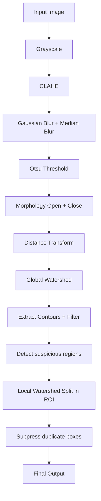

# Đếm hạt gạo bằng OpenCV

Pipeline đếm hạt gạo với mục tiêu **đếm đủ**, **không đếm trùng**, **hạn chế đếm sót** và **tách được các hạt dính nhau** bằng cách kết hợp:

- tiền xử lý ảnh
- watershed toàn ảnh
- local split cho các vùng nghi dính
- hậu kiểm loại box trùng

---

## 1. Mục tiêu

Bài toán cần đạt được:

- Không đếm trùng
- Không bị sót hạt
- Tách được các hạt dính nhau
- Có ảnh debug từng bước để dễ tinh chỉnh tham số

---

## 2. Điểm nổi bật của pipeline

Pipeline này giữ lại phần xử lý gốc đang hoạt động ổn định, sau đó chỉ **refine cục bộ** những vùng nghi là nhiều hạt bị dính.

### Ý tưởng chính
- Watershed toàn ảnh để tách phần lớn hạt
- Chỉ local split với ROI bất thường
- Nếu local split không đủ tốt thì **giữ nguyên vùng cũ**, tránh làm vỡ hạt đơn
- Cuối cùng loại box trùng bằng IoU, containment và khoảng cách tâm

---

## 3. Sơ đồ pipeline

```text
[Input Image]
      ↓
[Grayscale]
      ↓
[CLAHE]
      ↓
[Gaussian Blur + Median Blur]
      ↓
[Otsu Threshold]
      ↓
[Morphology: Open + Close nhẹ]
      ↓
[Distance Transform]
      ↓
[Watershed toàn ảnh]
      ↓
[Extract Contours + Filter]
      ↓
[Detect suspicious regions]
      ↓
[Local Split in ROI]
      ↓
[Suppress duplicate boxes]
      ↓
[Final Output]
```

### Mermaid diagram



---

## 4. Input / Output

## 4.1 Input
Ảnh chứa nhiều hạt gạo, định dạng:

- `jpg`
- `jpeg`
- `png`
- `bmp`
- `tif`
- `tiff`

## 4.2 Output
Pipeline sinh ra:

- Ảnh kết quả cuối có:
  - contour
  - bounding box
  - số thứ tự từng hạt
  - tổng số hạt
- File `results.txt`
- Bộ ảnh debug từng bước trong thư mục output

---

## 5. Cấu trúc thư mục gợi ý

```text
project/
├─ images/
│  ├─ img_1.jpg
│  ├─ img_2.png
│  └─ ...
├─ output/
│  ├─ img_1.step_0_original.jpg
│  ├─ img_1.step_1_gray.jpg
│  ├─ ...
│  ├─ img_1.step_15_final_output.jpg
│  └─ results.txt
└─ count_rice.py
```

---

## 6. Giải thích chi tiết từng bước

## 6.1 Grayscale + CLAHE
Chuyển ảnh màu sang ảnh xám để đơn giản hóa xử lý.

Sau đó tăng tương phản cục bộ bằng CLAHE:

- `clipLimit = 1.8`
- `tileGridSize = (8, 8)`

### Mục đích
- Làm nổi bật biên giữa hạt và nền
- Hỗ trợ threshold ổn định hơn khi ánh sáng không đều

---

## 6.2 Blur
Code đang dùng hai lớp làm mượt:

- `GaussianBlur(5,5)`
- `MedianBlur(3)`

### Mục đích
- Giảm nhiễu cục bộ
- Giữ được shape hạt tốt hơn so với làm mượt quá mạnh

---

## 6.3 Threshold bằng Otsu
Áp dụng Otsu để nhị phân hóa ảnh.

Mặc định dùng:

- `THRESH_BINARY_INV + THRESH_OTSU`

Sau đó code có kiểm tra tỷ lệ foreground:

- nếu `white_ratio > 0.70` thì đảo lại threshold

### Mục đích
- Tự thích nghi với nền sáng hoặc nền tối
- Giảm rủi ro chọn sai polarity

---

## 6.4 Morphology
Dùng morphology nhẹ:

- `OPEN` 1 lần
- `CLOSE` 1 lần
- kernel `3x3`

### Mục đích
- Loại nhiễu nhỏ
- Nối vùng bị đứt nhẹ
- Tránh làm mất các hạt nhỏ

---

## 6.5 Distance Transform toàn ảnh
Sau morphology, code tính distance transform để tìm vùng trung tâm của từng hạt.

### Global threshold đang dùng
```python
0.28 * dist_transform.max()
```

### Mục đích
- Sinh `sure_fg`
- Làm seed cho watershed toàn ảnh
- Giữ threshold đủ mềm để hạn chế sót hạt

---

## 6.6 Watershed toàn ảnh
Từ `sure_fg`, `sure_bg` và `unknown`, code tạo marker bằng:

- `connectedComponents`
- sau đó chạy `cv2.watershed(...)`

### Mục đích
- Tách phần lớn các hạt ngay từ đầu
- Tạo marker region tương ứng các object chính

---

## 6.7 Trích contour và lọc ban đầu
Sau watershed toàn ảnh, code lấy contour lớn nhất của từng marker rồi lọc theo các tiêu chí sau:

- `18 <= area <= 7000`
- `rect_area >= 15`
- loại contour có `fill_ratio < 0.18` nếu vùng quá nhỏ
- loại shape bất thường khi:
  - `aspect_ratio > 12`
  - và `area < 50`

### Mục đích
- Loại nhiễu
- Giữ lại phần lớn hạt thật
- Không đẩy local split vào quá nhiều vùng rác

---

## 7. Phát hiện vùng nghi dính

Một vùng được xem là nghi dính nếu **ít nhất một** trong các điều kiện sau đúng:

- `area > 1.75 * median_area`
- `aspect_ratio > 3.8`
- `peak_count >= 2`

Trong đó `peak_count` được đếm từ local distance transform sau khi threshold peak ở mức:

```python
0.40 * dist.max()
```

### Ý nghĩa
- **area lớn**: có thể chứa 2 hoặc nhiều hạt
- **aspect_ratio lớn**: vùng quá dài, có thể là 2 hạt nối nhau
- **nhiều peak**: có nhiều tâm khả nghi trong cùng một vùng

---

## 8. Local split trong ROI

Khi một vùng bị nghi dính, code chỉ tách bên trong ROI đó thay vì chạy lại toàn ảnh.

## 8.1 Quy trình local split
- tạo mask của riêng ROI
- morphology open nhẹ
- distance transform
- threshold local:
  ```python
  0.36 * dist.max()
  ```
- erosion nhẹ để tách hai tâm gần nhau
- watershed cục bộ

## 8.2 Điều kiện chấp nhận split
Split chỉ được chấp nhận nếu tạo ra **ít nhất 2 vùng hợp lệ**.

Một vùng hợp lệ phải thỏa:

- `area >= min_area`
- với `min_area = 18`
- và `area >= 0.22 * median_area`

Nếu split không đủ tốt, code **giữ nguyên contour cũ**.

### Đây là điểm rất quan trọng
Cơ chế này giúp pipeline tránh lỗi:

- 1 hạt bị chẻ thành 2
- vùng local split nhiễu làm sai kết quả tổng

---

## 9. Hậu kiểm loại box trùng

Sau khi refine, code chạy bước suppress duplicate.

Một box có thể bị loại nếu:

- `IoU > 0.45`
- box nằm trong box khác với `margin = 2`
- tâm hai box quá gần:
  ```python
  dist < 0.25 * size_ref
  ```
- và box nhỏ hơn có:
  ```python
  candidate_area < 0.75 * kept_area
  ```

### Mục đích
- Giảm đếm đôi
- Loại box con nằm trong box mẹ
- Giữ kết quả cuối gọn và ổn định hơn

---

## 10. Kết quả đầu ra

Ảnh cuối có các thành phần sau:

- contour màu xanh dương
- bounding box màu xanh lá
- số thứ tự màu đỏ
- text tổng:
  ```text
  Total: N
  ```

---

## 11. Debug từng bước

Code đang lưu các ảnh debug sau:

| Step | Tên ảnh |
|---|---|
| 0 | original |
| 1 | gray |
| 2 | gray_clahe |
| 3 | blur |
| 4 | thresh |
| 5 | opening |
| 6 | closing |
| 7 | sure_bg |
| 8 | distance_transform |
| 9 | sure_fg |
| 10 | unknown |
| 11 | markers_before_watershed |
| 12 | markers_after_watershed |
| 13 | valid_mask |
| 14 | valid_overlay |
| 15 | final_output |

---

## 12. Before / After

## 12.1 Before
Các lỗi thường gặp nếu chỉ threshold + contour đơn giản:

- 2 hạt dính nhau bị tính thành 1
- hạt nhỏ dễ bị sót
- vùng nhiễu có thể bị đếm nhầm

## 12.2 After
Sau khi thêm watershed + local split + duplicate suppression:

- hạt dính dễ được tách hơn
- giữ được hạt đơn tốt hơn
- tổng số ổn định hơn
- có ảnh debug để kiểm tra từng bước

> Gợi ý: bạn có thể chụp 2 ảnh trong thư mục `output/` để đưa vào README thực tế:
> - `step_14_valid_overlay`
> - `step_15_final_output`

---

## 13. Bảng tham số quan trọng

| Nhóm | Tham số | Giá trị hiện tại | Vai trò |
|---|---|---:|---|
| CLAHE | clipLimit | 1.8 | tăng tương phản nhẹ |
| CLAHE | tileGridSize | (8,8) | chia block CLAHE |
| Blur | Gaussian | (5,5) | làm mượt |
| Blur | Median | 3 | giảm nhiễu |
| Morphology | kernel | 3x3 | open/close nhẹ |
| Global DT | fg threshold | 0.28 | seed watershed toàn ảnh |
| Peak detect | peak threshold | 0.40 | đếm số peak trong ROI |
| Local split | fg threshold | 0.36 | seed watershed cục bộ |
| Candidate filter | min_area | 18 | loại vật thể quá nhỏ |
| Candidate filter | max_area | 7000 | loại vùng quá lớn bất thường |
| Suspicious region | area ratio | 1.75 | nghi nhiều hạt dính |
| Suspicious region | aspect_ratio | 3.8 | nghi vùng quá dài |
| Duplicate | IoU threshold | 0.45 | loại box trùng |

---

## 14. Troubleshooting

## 14.1 Hai hạt dính nhau vẫn bị tính 1
Thử giảm độ mạnh của threshold local split:

```python
0.36 -> 0.34
```

Hoặc giảm điều kiện nghi dính:

```python
1.75 -> 1.60
```

### Khi nào nên dùng
- ảnh có nhiều cặp hạt chạm nhau
- watershed cục bộ chưa đủ mạnh để tách

---

## 14.2 Một hạt bị chẻ thành hai
Tăng threshold local split:

```python
0.36 -> 0.38
```

### Khi nào nên dùng
- nhiều hạt đơn bị tách đôi
- marker local quá nhiều

---

## 14.3 Bị sót hạt nhỏ
Giảm `min_area`:

```python
18 -> 15
```

Hoặc giảm threshold global distance transform:

```python
0.28 -> 0.25
```

### Khi nào nên dùng
- ảnh có hạt nhỏ
- tương phản thấp
- seed foreground toàn ảnh bị thiếu

---

## 14.4 Bắt cả nhiễu
Tăng `min_area`:

```python
18 -> 22
```

### Khi nào nên dùng
- nền ảnh nhiều bụi / chấm nhỏ
- box rất nhỏ bị đếm nhầm

---

## 14.5 Tách quá ít vùng nghi dính
Giảm điều kiện detect suspicious region:

```python
aspect_ratio > 3.8
```

có thể thử xuống:

```python
aspect_ratio > 3.2
```

### Khi nào nên dùng
- nhiều cụm 2 hạt dài vừa phải nhưng không bị đưa vào local split

---

## 15. Cách chạy

```bash
python count_rice.py
```

Trong code hiện tại:

```python
if __name__ == "__main__":
    input_folder = "images"
    process_folder(input_folder, output_folder="output", save_steps=True)
```

### Ý nghĩa
- đọc tất cả ảnh trong thư mục `images`
- xử lý lần lượt
- lưu kết quả vào thư mục `output`

---

## 16. Hướng cải tiến tiếp theo

Một số hướng có thể nâng cấp thêm:

- thêm file `requirements.txt`
- lưu bảng thống kê CSV ngoài `results.txt`
- thêm ảnh so sánh before/after trực tiếp vào README
- thêm chế độ vẽ label đẹp hơn để tránh chồng chữ
- tối ưu tham số theo từng loại nền ảnh
- thêm đánh giá precision / recall nếu có ground truth

---

## 17. Kết luận

Pipeline hiện tại ưu tiên triết lý:

- **đừng làm vỡ hạt đơn**
- **chỉ split khi thật sự cần**
- **giữ recall tốt trước, rồi mới siết precision**
- **debug được từng bước để dễ chỉnh tham số**

Đây là một hướng thực dụng, dễ chỉnh và phù hợp với bài toán đếm hạt gạo từ ảnh tĩnh bằng OpenCV.
